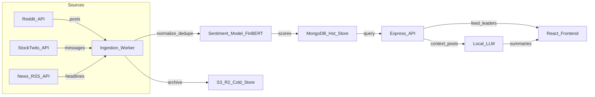

# 📈 Stock Sentiment Tracker

A lightweight, production-ready finance app that tracks real-time sentiment across Reddit, StockTwits, and news sources for stock tickers (starting with SPY). Data is ingested into MongoDB, enriched with finance-domain sentiment models (FinBERT), and exposed via a Node.js/Express API with a beautiful React frontend.


## 🎯 Features

- **Multi-Source Sentiment Analysis**: Aggregates data from Reddit, StockTwits, and news outlets
- **AI-Powered Insights**: Uses FinBERT for financial sentiment analysis
- **Real-Time Dashboard**: Beautiful React frontend with live sentiment metrics
- **Automated Data Collection**: Background worker ingests data every 15 minutes
- **RESTful API**: Well-documented Express API with rate limiting
- **Timeline Visualization**: Track sentiment trends over time
- **Source Breakdown**: See sentiment distribution by platform
- **Scalable Architecture**: MongoDB with optimized indexes and aggregation pipelines

## 🏗️ Architecture



## 🚀 Quick Start

### Prerequisites

- Node.js v16+
- MongoDB v5+ (local or Atlas)
- npm or yarn

### 1. Clone the Repository

```bash
git clone <your-repo-url>
cd StockSentiment
```

### 2. Install Dependencies

```bash
# Backend
cd backend
npm install

# Frontend
cd ../frontend
npm install
```

### 3. Configure Environment

```bash
# Backend
cd backend
cp env.example .env
# Edit .env with your API credentials (see SETUP.md)
```

### 4. Start MongoDB

```bash
# macOS
brew services start mongodb-community

# Linux
sudo systemctl start mongod

# Or use MongoDB Atlas (cloud)
```

### 5. Run the Application

**Terminal 1 - Backend:**
```bash
cd backend
npm start
```

**Terminal 2 - Worker:**
```bash
cd backend
npm run worker
```

**Terminal 3 - Frontend:**
```bash
cd frontend
npm start
```

Open [http://localhost:3000](http://localhost:3000) in your browser!

## 📖 Full Setup Guide

For detailed instructions on setting up API providers (Reddit, StockTwits, News API) and MongoDB, see **[SETUP.md](SETUP.md)**.

## 🐳 Docker Deployment

Run the entire stack with Docker:

```bash
# Create .env file first
cd backend
cp env.example .env
# Add your API credentials

# Start all services
cd ..
docker-compose up -d
```

Services will be available at:
- Frontend: http://localhost:3000
- Backend API: http://localhost:5000
- MongoDB: localhost:27017

## 📊 API Endpoints

### Sentiment Data

- `GET /api/sentiment/posts/:ticker` - Get recent posts
- `GET /api/sentiment/stats/:ticker` - Get sentiment statistics
- `GET /api/sentiment/timeline/:ticker` - Get hourly sentiment timeline
- `GET /api/sentiment/top/:ticker` - Get top posts by sentiment
- `GET /api/sentiment/health` - Health check

**Example:**
```bash
curl http://localhost:5000/api/sentiment/stats/SPY?hours=24
```

## 🎨 Screenshots

### Sentiment Dashboard
- Overall sentiment gauge (Bullish/Bearish/Neutral)
- Breakdown by sentiment type
- Timeline chart
- Source statistics

### Posts Feed
- Real-time posts from all sources
- Filter by source and sentiment
- Direct links to original posts
- Engagement metrics

## 🧪 Testing

```bash
# Backend tests
cd backend
npm test

# Test API manually
npm run worker -- --once  # Run one ingestion cycle
curl http://localhost:5000/api/sentiment/health
```

## 📁 Project Structure

```
StockSentiment/
├── backend/
│   ├── src/
│   │   ├── config/        # Database configuration
│   │   ├── models/        # Mongoose schemas
│   │   ├── routes/        # API routes
│   │   ├── services/      # Data sources & sentiment
│   │   ├── workers/       # Background ingestion
│   │   ├── tests/         # API tests
│   │   └── server.js      # Express app
│   ├── package.json
│   └── Dockerfile
│
├── frontend/
│   ├── src/
│   │   ├── components/    # React components
│   │   ├── services/      # API client
│   │   ├── App.js
│   │   └── index.js
│   ├── public/
│   ├── package.json
│   └── Dockerfile
│
├── docker-compose.yml
├── README.md
└── SETUP.md
```

## 🔧 Configuration

### Backend Environment Variables

```env
# Server
PORT=5000
NODE_ENV=development

# Database
MONGODB_URI=mongodb://localhost:27017/stock-sentiment

# APIs (see SETUP.md for how to get these)
REDDIT_CLIENT_ID=your_id
REDDIT_CLIENT_SECRET=your_secret
REDDIT_USER_AGENT=StockSentimentApp/1.0
RAPIDAPI_KEY=your_rapidapi_key
NEWS_API_KEY=your_key

# Worker
INGESTION_INTERVAL_MINUTES=15
```

## 🎯 Adding More Tickers

Edit `backend/src/workers/ingestionWorker.js`:

```javascript
this.tickers = ['SPY', 'QQQ', 'AAPL', 'TSLA', 'NVDA'];
```

## 🔐 API Rate Limits

| Service | Free Tier | Notes |
|---------|-----------|-------|
| Reddit | 60 req/min | Sufficient for multiple tickers |
| StockTwits (RapidAPI) | 1000 req/hr | 500k/month via RapidAPI |
| News API | 100 req/day | Has RSS fallback |

## 🚢 Production Deployment

### Recommended Platforms

**Backend & Worker:**
- Railway.app (recommended)
- Heroku
- DigitalOcean App Platform

**Frontend:**
- Vercel (recommended)
- Netlify
- Cloudflare Pages

**Database:**
- MongoDB Atlas (free tier)

### Environment Setup

1. Set `NODE_ENV=production`
2. Use HTTPS URLs
3. Configure CORS for your domain
4. Set up environment variables in platform
5. Enable MongoDB connection string

## 📈 Performance

- **MongoDB Indexes**: Optimized for fast queries
- **Rate Limiting**: Built-in API protection
- **Caching**: Can add Redis for better performance
- **Worker Schedule**: Configurable ingestion intervals

## 🛠️ Tech Stack

**Backend:**
- Node.js + Express
- MongoDB + Mongoose
- FinBERT (via Transformers.js)
- Snoowrap (Reddit API)
- Axios (HTTP client)
- Node-cron (Scheduling)

**Frontend:**
- React 18
- Recharts (Visualization)
- Axios (API client)
- Date-fns (Date formatting)
- CSS3 (Modern styling)

## 🤝 Contributing

1. Fork the repository
2. Create a feature branch
3. Make your changes
4. Write tests
5. Submit a pull request

## 📝 License

MIT License - feel free to use this project for personal or commercial purposes.

## 🙏 Acknowledgments

- FinBERT team for the sentiment model
- Data providers: Reddit, StockTwits, News API
- Open source community

## 📞 Support

For setup help, see [SETUP.md](SETUP.md).

For issues, please open a GitHub issue.

---

**Built with ❤️ for the trading community**
